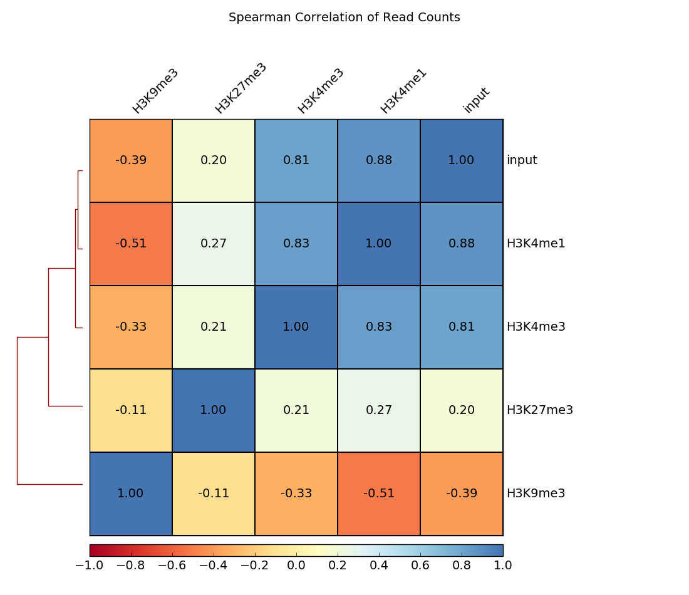

# deepTools: a Powerful Tool to Analyze and Process Deep Sequencing Data
### By Haesol Jung, Meiqi Lai, Lydia Roh

## Example Image

## Content 
1. [Abstract](#011)
2. [Introduction](#211)
3. [Key Features](#3)  
   3.1. [File Conversion](#311) 
   3.2. [Signal Normalization](#321) 
   3.3. [Compute Matrix](#331) 
   3.4. [Visualization Tools](#341) 

4. [Work Flow](#4)  
   4.1. [Correlation between BAM Files](#411) 
   4.2. [Coverage Check](#421) 
   4.3. [GC-Bias Check](#431) 
   4.4. [Assessing the CHIP Strength](#441)<be>

5. [Applications of deepTools](#511)
6. [Conclusion](#611)
7. [References](#711)

## 01 Abstract

Next-generation sequencing (NGS) technologies have revolutionized genomics research. This technology generates massive datasets that require tools for efficient analysis and visualization. deepTools is a collective bioinformatics tool designed to address these challenges, particularly for epigenomics and transcriptomics studies. This paper provides an in-depth overview of deepTools, its key features, and its application in workflows. With its ability to streamline the processing of genome-wide coverage files and generate high-quality visualizations, deepTools is a useful resource for researchers to navigate the complexities of high-throughput sequencing data.

## 02 Introduction
### What is "deepTools"?
deepTools is essentially a collection of tools, used primarily in the Bioinformatics field, designed for analysis and visualization of data obtained from Next Generation Sequencing Technologies[Chip-Seq, RNA-Seq, ATAC-Seq]. It is useful in the way that the design of the toolkit allows for it to handle large datasets, making it easier for researchers to use for processing, quality control as well as visualization purposes.

### Purpose of deepTools
deepTools is a suite of command-line tools designed for the analysis and visualization of high-throughput sequencing data. Its key objectives include enabling researchers to:
* Convert large and complex files into compact, analyzable formats.
* Normalize sequencing data for meaningful comparisons.
* Prepare data for visualization.
* Generate publication-ready plots and graphs.

## 03 Key Features

### 3.1 File Conversion 

One of the core functionalities of deepTools is the conversion of large, raw data files into smaller, more efficient formats. BAM files, which store aligned sequencing reads, are often unwieldy and challenging to work with for downstream analyses. deepTools provides tools like `bamCoverage` and `bamCompare` to convert BAM files into bigWig files, a binary format optimized for storage and visualization. Below is a table that actually details the differences betwen these 2 types of files.

| **Aspect**         | **BigWig File**                                | **BAM File**                                   |
|---------------------|-----------------------------------------------|-----------------------------------------------|
| **File Type**       | Binary format for storing continuous values over genome regions. | Binary format for storing sequence alignment data. |
| **Purpose**         | Represents summarized data, such as coverage or signal intensity. | Represents read alignments against a reference genome. |
| **Data Content**    | Stores processed data (e.g., coverage graphs). | Stores raw read alignments, including mapping quality and sequence. |
| **Size**            | Generally smaller due to summarization.       | Larger because it includes detailed alignment data for each read. |
| **Usage**           | Visualization of genomic signals (e.g., in genome browsers). | Detailed analysis of sequencing data, such as variant calling. |
| **Indexing**        | Requires an associated index file (`.bw`) for efficient access. | Requires an associated index file (`.bai`) for efficient access. |
| **Compression**     | Compressed binary format for efficiency.      | Compressed binary format (BGZF).             |
| **Compatibility**   | Used primarily with genome browsers (e.g., UCSC Genome Browser, IGV). | Used with bioinformatics tools (e.g., SAMtools, Picard). |
| **Generation**      | Created from BAM files or other data sources via tools like `bedGraphToBigWig`. | Generated directly from sequencing data after alignment. |
| **Example Use Case**| Visualizing ChIP-seq peak intensities or RNA-seq coverage. | Analyzing sequence alignment to identify variants or gene expression. |

### 3.2 Signal Normalization 

Normalization ensures that data comparisons between samples, conditions, or replicates are biologically meaningful. Variations in sequencing depth, library size, or experimental conditions can introduce biases that skew results. deepTools supports several normalization methods, including Reads Per Kilobase per Million (RPKM), Counts Per Million (CPM), and SES (Simple Scaling).

### 3.3 Compute Matrix 

The `computeMatrix` tool prepares data for visualization by organizing signals from bigWig files around regions of interest defined in BED files. This step is essential for creating heatmaps and profile plots.

### 3.4 Visualization Tools 

deepTools includes powerful visualization options, such as `plotHeatmap` and `plotProfile`, which enable researchers to interpret complex datasets visually. Heatmaps, for example, can display enrichment patterns across multiple conditions or datasets, while profiles provide average signal distributions.

## 04 Work Flow
### 1) Correlation between BAM Files 
The tools multiBamSummary and plotCorrelation work together to perform a fundamental check to ensure that the sequenced and aligned reads align with your expectations. These modules are used to evaluate reproducibility, either between replicates or across different experiments that share common factors, such as the same antibody or cell type. For example, replicates are expected to show higher correlation compared to samples treated under different conditions.

**Figure 4.1: Spearman Correlation of Read Counts Across Different Histone Modifications and Input Samples**

This heatmap illustrates the Spearman correlation coefficients of read counts between various histone modifications (H3K9me3, H3K27me3, H3K4me3, H3K4me1) and input samples. The clustering dendrogram on the left highlights relationships among samples, with closer branches indicating higher similarity. Positive correlations are represented by blue shades, while negative correlations are shown in orange to red. Strong correlations (closer to 1.0) between replicates or similar experimental conditions demonstrate reproducibility, whereas weaker correlations (closer to -1.0) may indicate significant differences between treatments or distinct biological conditions.

### 2) Coverage Check 
### 3) GC-Bias Check 
### 4) Assessing the CHIP Strength 

## 05 Applications of deepTools

#### Epigenomic Studies

deepTools is commonly used in epigenomics to analyze histone modifications, transcription factor binding, and chromatin accessibility. By visualizing patterns of enrichment, researchers can uncover regulatory mechanisms and chromatin states.

#### Transcriptomics
In RNA-seq experiments, deepTools facilitates the normalization and visualization of gene expression data. This enables meaningful comparisons across different conditions or treatments.

#### Comparative Studies

deepTools is ideal for comparing datasets across conditions, replicates, or time points. Normalized visualizations help identify differential signals and reproducibility issues.

#### Multi-Omics Integration

Researchers often combine ChIP-seq, RNA-seq, and other datasets in multi-omics studies. deepTools provides the flexibility to analyze and visualize these datasets together.

## 06 Conclusion 
deepTools has become an essential toolkit for researchers working with high-throughput sequencing data. Its ability to process, normalize, and visualize genomic datasets efficiently enables scientists to derive meaningful biological insights from complex experiments. As NGS technologies continue to advance, deepTools will remain a critical resource for the genomics community, empowering researchers to unlock new discoveries in epigenomics, transcriptomics, and beyond.

## References 
1. Ramírez, F., Ryan, D. P., Grüning, B., Bhardwaj, V., Kilpert, F., Richter, A. S., Heyne, S., Dündar, F., & Manke, T. (2016). deepTools2: a next generation web server for deep-sequencing data analysis. Nucleic Acids Research, 44(W1), W160-W165.
2. Ramírez F, Dündar F, Diehl S, Grüning BA, Manke T. deepTools: a flexible platform for exploring deep-sequencing data. Nucleic Acids Res. 2014 Jul;42(Web Server issue):W187-91. doi: 10.1093/nar/gku365. Epub 2014 May 5. PMID: 24799436; PMCID: PMC4086134.
3. deepTools Documentation: https://deeptools.readthedocs.io
